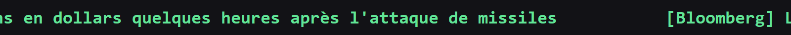

# news-bar

Une barre fine qui défile en bas de l'écran, façon bandeau d'actualités : les titres de tes flux RSS, **cliquables**, et (en option) **traduits en français**.

Binaire natif unique (~800 Ko), zéro runtime à installer.



- Ancrée en bas (ou en haut), elle **réserve son espace** : les fenêtres maximisées s'arrêtent juste au-dessus, comme la barre des tâches.
- **Clic gauche** sur un titre : ouvre l'article dans le navigateur.
- Se met à jour toute seule.

---

## Installer

### Option 1 : à la main (le plus simple)

Ouvre **PowerShell** et colle cette ligne :

```powershell
powershell -c "irm https://github.com/enixCode/news-bar/releases/latest/download/news-bar-installer.ps1 | iex"
```

Puis lance la barre une fois :

```powershell
news-bar
```

C'est tout. Elle démarre, s'ajoute au démarrage de Windows, et se met à jour toute seule.

### Option 2 : laisser un agent IA le faire

Tu utilises un agent de code (Claude Code, Cursor...) ? Ouvre **[AGENT-SETUP.md](AGENT-SETUP.md)**, copie le bloc dedans et colle-le à ton agent : il installe news-bar, **te demande quels sujets d'actu tu veux suivre**, configure tes flux, active la traduction, et vérifie que tout tourne. Rien à régler à la main.

---

## Utilisation

- **Clic gauche** sur un titre : ouvre l'article dans ton navigateur.
- **Clic droit** : « Fermer la barre ».
- Elle revient au prochain démarrage de Windows.

---

## Configuration

Tous tes réglages sont dans **un seul fichier** :

```
%APPDATA%\news-bar\config.json
```

Pour l'ouvrir : `Win + R`, colle `%APPDATA%\news-bar`, Entrée, puis ouvre `config.json` avec le Bloc-notes. Modifie, **enregistre**, puis relance la barre (clic droit dessus « Fermer la barre », puis tape `news-bar`).

### Changer les actualités affichées

C'est la partie `feeds` : une liste de sources. Chaque source a un **nom court** (affiché entre crochets) et l'**adresse du flux RSS** :

```json
"feeds": [
  { "source": "Le Monde",    "url": "https://www.lemonde.fr/rss/une.xml" },
  { "source": "Hacker News", "url": "https://news.ycombinator.com/rss" }
]
```

Pour ajouter une source, ajoute une ligne `{ "source": "...", "url": "..." }` (sépare-les par une virgule). La plupart des sites d'actu ont un flux RSS : cherche « *nom du site* RSS ».

### Les autres réglages

| Réglage | Ce que ça change | Exemple |
|---|---|---|
| `position` | en bas ou en haut de l'écran | `"bottom"` ou `"top"` |
| `speed` | vitesse de défilement | `1.5` (plus grand = plus rapide) |
| `colors.foreground` | couleur du texte `[Rouge, Vert, Bleu]` | `[96, 230, 150]` (vert) |
| `colors.background` | couleur du fond | `[18, 18, 22]` (presque noir) |
| `font.name` | la police | `"Consolas"`, `"Segoe UI"` |
| `font.size` | la taille du texte | `11` |
| `refresh_minutes` | toutes les combien de minutes ça se met à jour | `15` |
| `segments` | tes textes fixes (rappels, raccourcis) | voir ci-dessous |
| `translate` | traduire les titres | `true` ou `false` |
| `language` | langue de traduction | `"français"`, `"anglais"`... |

### Afficher ton propre texte (rappels, raccourcis...)

Tu peux mêler **tes propres textes fixes** aux actualités, ou n'afficher que ça (sans aucun flux). C'est la clé `segments` :

```json
"segments": [
  "[VIM] i = ecrire    Echap = naviguer    dd = couper    yy = copier    p = coller    /texte = chercher    u = annuler"
]
```

Chaque entrée est une ligne qui défile (non cliquable). Pour n'avoir **que** tes textes (sans actualités), laisse `feeds` vide.

### Traduire les titres

Par défaut c'est le **français** ; pour une autre langue, change `language` dans `config.json` (`"anglais"`, `"español"`...). C'est gratuit, via Groq. Trois étapes :

1. Crée une clé sur **[console.groq.com](https://console.groq.com)** (API Keys → Create).
2. Dans PowerShell, colle (en remplaçant par ta clé) :
   ```powershell
   setx GROQ_API_KEY "ta_cle"
   ```
3. Relance la barre (`news-bar`).

Sans clé, les titres restent dans leur langue d'origine, c'est tout. **Ne mets jamais ta clé dans `config.json`** : la variable d'environnement la garde en sécurité, hors du fichier.

---

## Mettre à jour / Désinstaller

**Mise à jour** : automatique, elle se fait toute seule au démarrage.

**Désinstaller** (arrête la barre, retire le démarrage auto et la config) :

```powershell
irm https://raw.githubusercontent.com/enixCode/news-bar/main/uninstall.ps1 | iex
```

---

## Pour les développeurs

Construire localement :

```powershell
cd rust
cargo build --release
```

Le binaire est dans `rust/target/release/news-bar.exe`.

**Mode dev** : `news-bar --dev` (ou `cargo run --release -- --dev`) lance une instance qui cohabite avec ta version installée : elle s'affiche en **orange** avec un repère « MODE DEV », **ne s'inscrit pas au démarrage** et **ne se met pas à jour**. Tu peux donc avoir ta barre de prod et ta barre de dev **empilées en même temps**.

La distribution est gérée par **[dist](https://opensource.axo.dev/cargo-dist/)** (`dist-workspace.toml`) + un workflow GitHub Actions (`.github/workflows/release.yml`) : pousser un tag `vX.Y.Z` déclenche le build dans le cloud et publie la Release (binaire + installeur + updater).

```
news-bar/
├─ dist-workspace.toml            distribution (dist)
├─ config.json                    modele de config par defaut
├─ AGENT-SETUP.md                 guide complet pour un agent IA
├─ uninstall.ps1
└─ rust/src/
   ├─ main.rs       point d'entree (+ auto-update)
   ├─ config.rs     lecture de config.json
   ├─ feeds.rs      fetch + parsing RSS/Atom (ureq + roxmltree)
   ├─ translate.rs  traduction FR via Groq
   └─ platform/windows/  fenetre, rendu GDI, AppBar, clic, autostart
```

Réseau : `ureq` + native-tls (certificats du magasin Windows). Architecture découpée par OS, prête pour un futur backend Linux (X11).

## Prérequis

Windows 10 ou 11.

## Licence

MIT. Voir [LICENSE](LICENSE).
